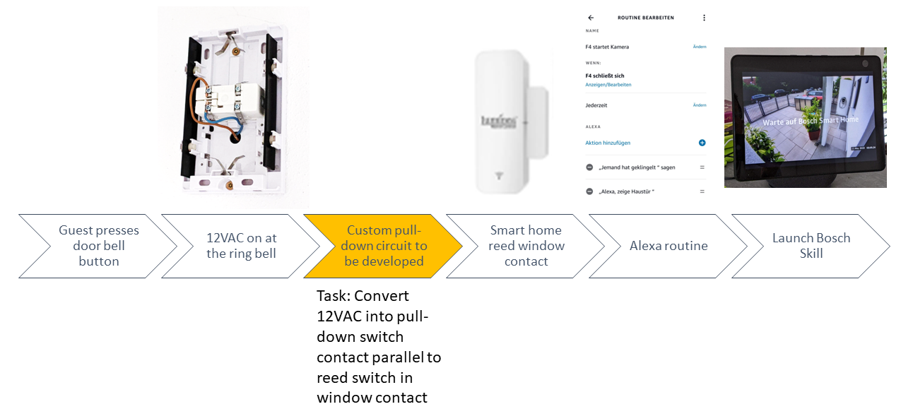
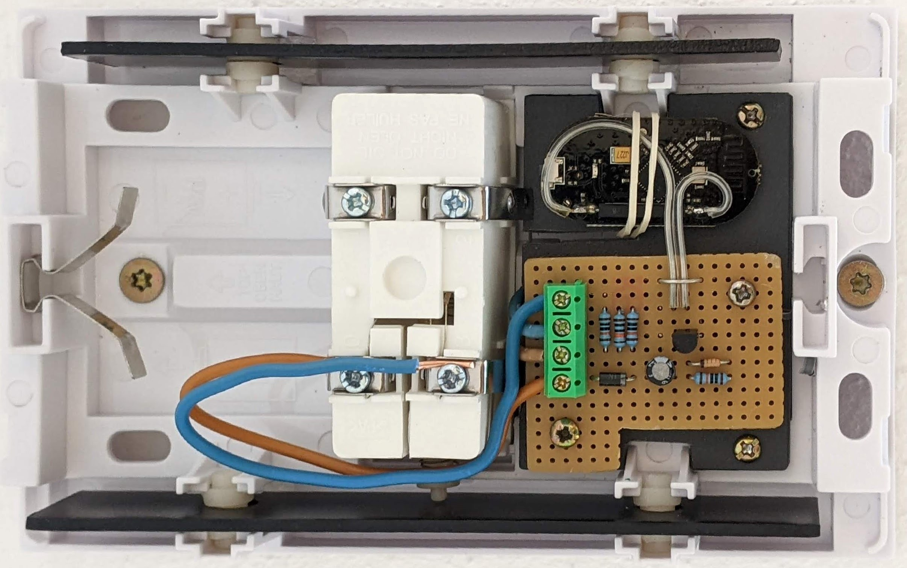

# Alexa doorbell project
The goal of this project is to connect a traditional doorbell to Amazon Alexa to display the Bosch Eyes camera stream on an Echo Show 10. The intended flow of action is shown below:

The simplest input sensors for Alexa routines seem to be reed window sensors. Most window sensors are connected via WiFi, which has two disadvantages:
1. The need to connect the Alexa account to a third-party account from the sensor manufacturer.
2. There is an additional delay, at least when tested with a [Luminea sensor](https://www.pearl.de/a-NX4900-3103.shtml)

Instead of a WiFi sensor I decided to use a Zigbee sensor, which is easily done because the Echo Show 10 includes a Zigbee hub.
The [SONOFF SNZB-04](https://sonoff.tech/product/smart-home-security/snzb-04/) seems as a good choice for my application. It's integration with the custom pull-down circuit into the ringbell houding is shown here:

